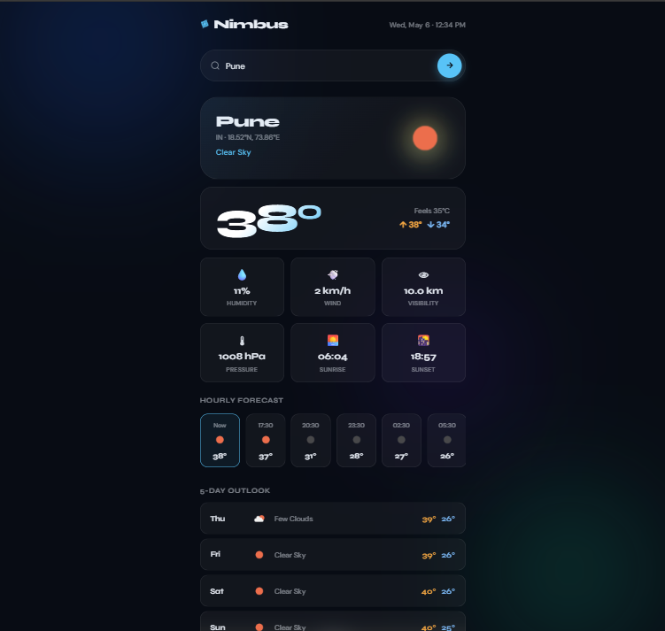

# Nimbus Weather App


A modern, aesthetic weather application built using **HTML, CSS, and JavaScript**, delivering real-time weather data with a smooth, immersive UI.

Designed with a **glassmorphism + aurora + neon** interface to create a premium user experience.
Built to demonstrate strong frontend fundamentals, API integration, and UI/UX design skills.

---

## Live Demo

[Live Demo](https://nimbus-weather-app-tan.vercel.app/)

[GitHub Repository](https://github.com/siddhipawar424/nimbus-weather-app)

---

## Preview



---

## Features

* Search weather by city
* Auto-detect user location (Geolocation API)
* Real-time temperature & “feels like” data
* Wind speed, humidity, pressure, visibility
* Sunrise & sunset timings
* Live clock updates
* Hourly forecast (next 24 hours)
* 5-day weather forecast
* Dynamic UI based on weather conditions
* Smooth animations & glassmorphism design
* Fully responsive (mobile + desktop)

---

## Tech Stack

* HTML5
* CSS3
* JavaScript (ES6+)
* OpenWeather API
* Geolocation API

---

## API Setup

This project uses the OpenWeather API.

**Important:**
For security reasons, API keys are not stored in the code.

### How it works:

* When you open the app, you will be prompted to enter your OpenWeather API key
* The key is stored securely in your browser (localStorage)
* You only need to enter it once

### Steps to use:

1. Get your API key from: https://openweathermap.org/api
2. Open the app
3. Enter your API key when prompted


---

## Run Locally

```bash
git clone https://github.com/siddhipawar424/nimbus-weather-app.git
cd nimbus-weather-app
open index.html
```

---

## Deployment

This project is deployed using **Vercel**.

You can also deploy it on:

* GitHub Pages
* Netlify

---

## Future Improvements

* Dark / Light mode toggle
* Weather charts & analytics
* Weather alerts system
* Multi-language support
* Offline support (PWA)

---

## Author

**Siddhi Pawar**

---

## Support

If you found this project useful or interesting, consider giving it a ⭐ on GitHub!
